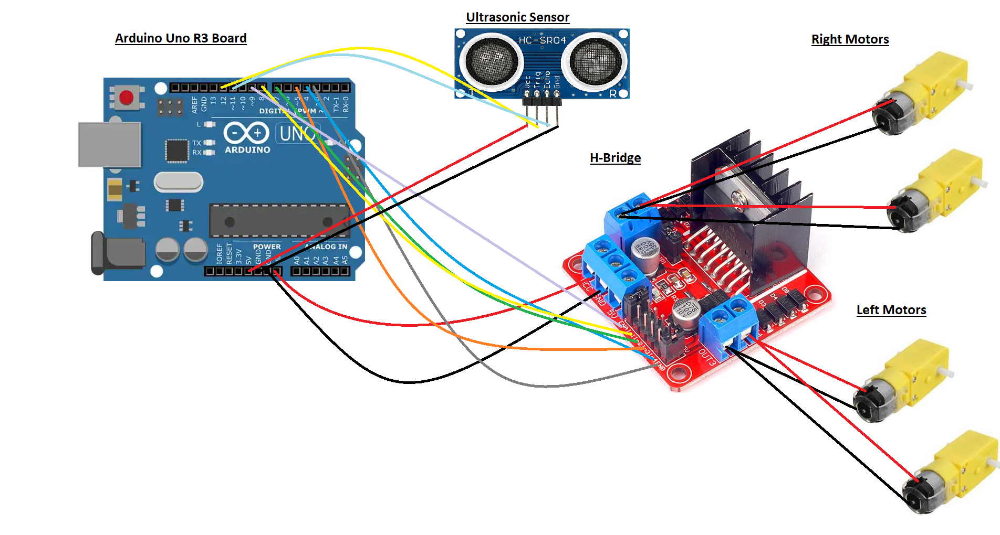

# EGN 3000L Project  |Arduino robot that follows an object|
## Introduction
  This project is related to USF EGN 3000L Team L's project, which includes designing an autonomous robot using the Arduino Uno R3 board. Other important parts of the robot include an untrasonic sensor and an H-bridge to control the geared motors. The code included in this project is designed to make the Arduino robot car follow an object. It essentially uses the ultrasonic sensor to send pulses to a nearby object, calculates the time it takes for an echo to travel back to the sensor, converts the time to distance (in centimeters), and makes the robot move rightwards, leftwards, straight, or stop depending on the distance.
  
## Prerequisites
   Before continuing, you must have met the following requirements:
    * Familiarity with the Arduino web editor or the downloaded the Arduino Desktop IDE (*If not, refer to __Getting the Arduino Software__*).
    * Have the required hardwares: 
      * Arduino Uno R3 board
      * H-bridge
      * Ultrasonic Sensor
      * 4 Geared Motors
     * Have a chassis for the robot that has designated space for the hardwares.
     
## Getting the Arduino Software
  1. Go to the website https://www.arduino.cc/
  2. Click on the “Sign In” button on the top right of the screen. If the user already has an account, they can go ahead and sign in. If not, they can create a new account by clicking “Create A New Account” and follow the directions of the website to create a new account.
  3. If the user would like to program online by using the Arduino Web Editor, they may refer to the link below:
      1. https://create.arduino.cc/projecthub/Arduino_Genuino/getting-started-with-arduino-web-editor-on-various-platforms-4b3e4a
  4. If the user would like to program offline by downloading the Arduino Desktop IDE, they may refer to the link below, scroll down to __"Install the Arduino Desktop IDE"__, and select the operating system the user is using.
      1. https://www.arduino.cc/en/Guide
    
  ## How to install code into Arduino.
  1. Copy the code from Arduino: Follow Me Robot Code in files.
  2. Paste the code into the Arduino Editor.
  3. Upload code into the Arduino Board.
    
 ## Connections Diagram
   
   
 ## Final Step
  Assemble all of the hardware onto the chassis. Place intended object the robot will follow in front of the sensors (10 cm - 15 cm away). Turn on the robot by connecting a 9V battery with the Arduino Board. Move the object around to prompt the robot to move. And that's it!

### Contributers
  __Molina Hoy (Software Lead)__
